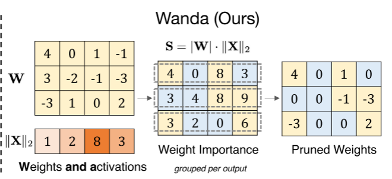
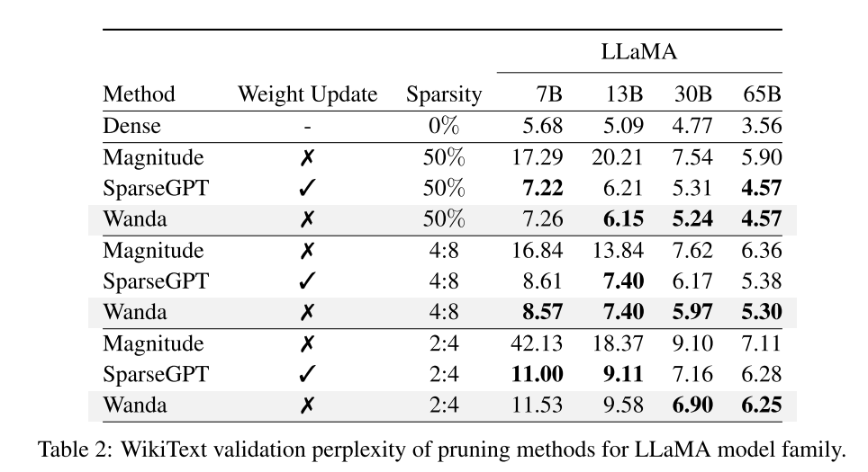
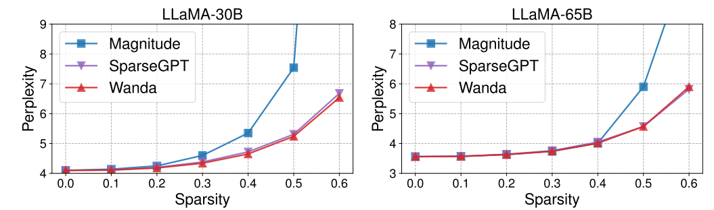
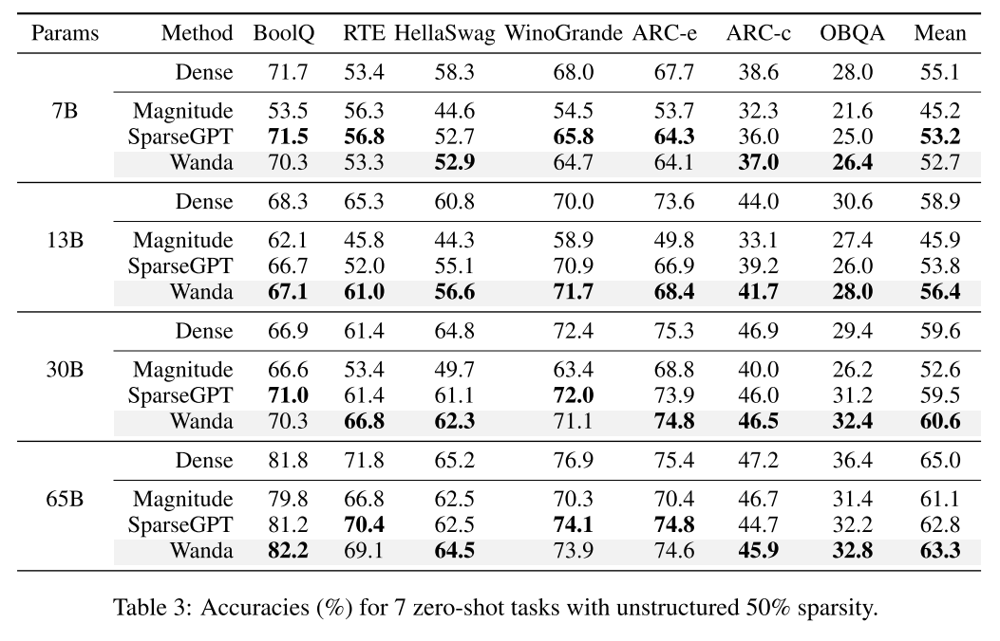
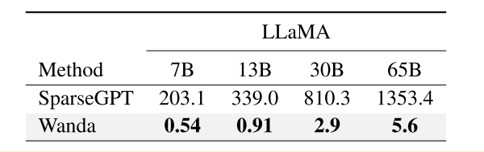

# Wanda

Wanda 剪枝方法受大语言模型中出现的**异常特征**启发，针对每个输出，用权重幅度值乘以相应的输入激活值作为重要性得分，以修剪权重。该方法能使得预训练的大语言模型得到一个稀疏性的网络结构。

针对大语言模型剪枝问题，本文作者提出了 wanda 方法，在LLaMA上用许多指标进行评估，它比幅度剪枝方法效果好，且比 SparseGPT 速度快，性能相近或更优。

## 背景

现有的常见剪枝方法通常需要再训练，时间与计算开销大。最近的 SparseGPT 不需要再训练，但仍然需要一个计算密集型的权重更新过程。除此以外，以往模型剪枝中成功的幅度剪枝方法，在较低稀疏度要求的大模型上却失败了，这说明尽管参数量变多了，但实际上却更难剪枝了。

### 异常特征

这是基于 Transformer 的大语言模型特有的。当模型达到一定规模时(大约6B参数)，一组隐藏的状态特征会出现，其幅度明显大于其余的状态特征。

- 幅度大
- 稀疏的
- 对模型的预测能力至关重要

## method

利用权重幅值与输入激活来计算权重的重要性，且剪枝粒度考虑在每个输出中比较。

**为什么要相乘来计算重要性？**

$y=w_1x_1+w_2x_2$

因为我们在挑选被修剪的权重时，最终的目标是希望，对相同的输入剪枝前后输出的变化不要太大。而以往的幅度剪枝方法直接比较权重，这在输入的幅值差异不大的情况下有效。但在大语言模型中，因为异常特征的存在，所以有的输入幅值会远远大于其余的输入幅值，所以应该同时考虑到输入幅值而不能仅考虑权重幅值。

**权重的重要性公式** $S_{ij}=|W_{ij}|·||X_j||_2$

使用权重幅值与输入特征2范数的乘积来评估重要性。文中简单解释使用 2 范数是因为它更平滑，比别的范数更有效地测量激活量。

- 考虑权重的输入通道具有较大幅值的特征时，更倾向于对该权重赋予更大的重要性，即使它的权重幅值很小。
- 计算简单，只需要一个乘法运算。
- 稳定性比较好；不用过于依赖原始训练数据，只需要适度校准样本。

**为什么剪枝粒度选择为每个输出通道？**

之前的修剪方法大多是按层或全局剪枝，但本文作者认为在大模型中考虑更局部的剪枝粒度是更好的（**我觉得他认为离得近的权重关联性更大一点**）。

**剪枝分组**：$G_{ij} = {W_{uv}| u = i}$

作者发现对大语言模型，按输出通道剪枝比按层剪枝好。可能是因为按输出通道剪枝可以防止不同输出特征之间的不平衡修剪。

Wanda 在计算重要性得分时是分层的：计算重要性，剪枝，然后激活后续层，再计算重要性，再剪枝……与 SparseGPT 相比，Wanda 少了更新权重的过程。

在 SparseGPT 中，权重的重要性为 

$S_{ij}=[|W|^2/diag(X^TX+\lambda I)^{-1}]_{ij}$

当 $\lambda$ 为 0 时，会发现两个重要性评分就差了一个平方。

## 实验

测试语言建模能力。

Wanda和SparseGPT表现出相似的困惑度随着稀疏度的提高而增加的趋势。

零样本下游任务测试

在 Nvidia A6000 上的剪枝时间。单位 秒。

